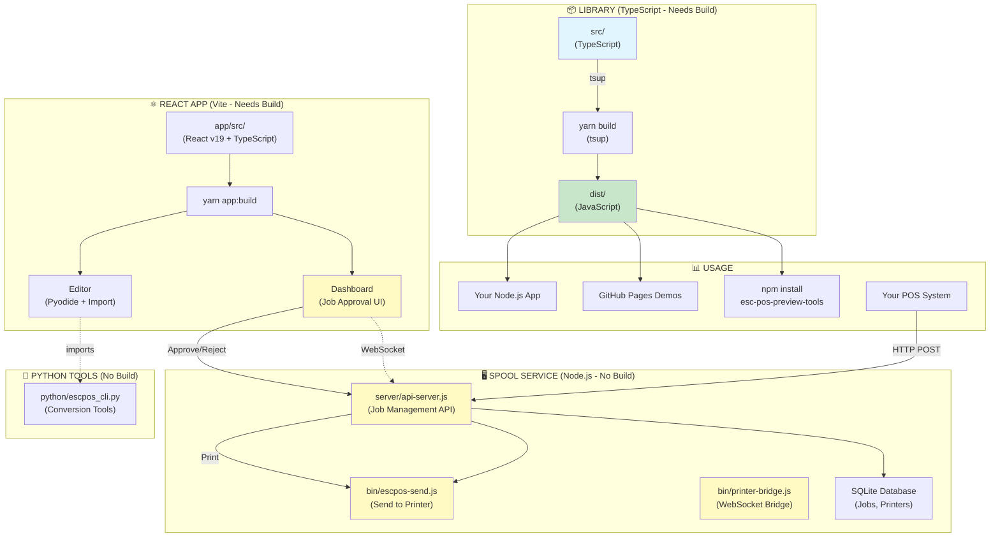

# ESC/POS Preview Tools

**Parse and render ESC/POS thermal printer commands** with a complete toolkit for development, testing, and production printing workflows.

[]() [](LICENSE)

---

## What Is This?

A comprehensive ESC/POS toolkit with **two main components**:

### 1. **Library** (TypeScript) - Parse & Render
Parse ESC-POS bytes and render as HTML for testing and preview.

### 2. **Spool Service** (Node.js) - Production Printing ⭐ NEW
Full job approval workflow with web dashboard, API, and chain printing.

---

## 🏗️ Architecture Overview



### 🔑 Key Points:

**Library (TypeScript):**
- ✅ Needs `yarn build` to compile TypeScript → JavaScript
- 📦 Used by: npm package, GitHub Pages, your applications
- 🎯 Purpose: Parse ESC-POS, render HTML previews

**Spool Service (Node.js):**
- ⚡ **No build needed** - runs directly with Node.js
- 🚀 Ready to use: `yarn server`
- 🎯 Purpose: Production print job management and approval

**Python Tools:**
- ⚡ **No build needed** - plain Python scripts
- 🎯 Purpose: ESC-POS ↔ python-escpos conversion

---

## Quick Start

### Option A: Use as Library (Parse & Render)

```bash
# Install
npm install esc-pos-preview-tools

# Use in your code
import { CommandParser, HTMLRenderer } from 'esc-pos-preview-tools';
```

### Option B: Run Spool Service (Job Management)

```bash
# Clone and install
git clone https://github.com/cobyhausrath/esc-pos-preview-tools.git
cd esc-pos-preview-tools
yarn install

# Start spool service
yarn server

# In another terminal, start React app
yarn app:dev

# Open http://localhost:5173 to access Dashboard and Editor
```

See [📖 Spool Service Documentation](#spool-service-job-management) below.

---

## Features

### 📚 Library Features

✅ **Parse ESC/POS Commands** - Text formatting, alignment, paper control
✅ **Render to HTML** - Thermal printer styling with authentic look
✅ **TypeScript Support** - Full type definitions and IntelliSense

### 🖨️ Spool Service Features ⭐ NEW

✅ **Job Approval Workflow** - Submit, review, approve/reject, print
✅ **Web Dashboard** - Real-time job monitoring with WebSocket updates
✅ **REST API** - Complete job and printer management
✅ **Chain Printing** - Multi-stage approval (dev → staging → production)
✅ **SQLite Database** - Persistent job storage and audit trail
✅ **Multiple Printers** - Physical (TCP/IP) and spool (chaining) support

### 🐍 Python Tools

✅ **Bidirectional Conversion** - ESC-POS ↔ python-escpos
✅ **CLI Tool** - Convert, verify, and execute
✅ **Browser Editor** - Edit receipts with live preview (Pyodide)
✅ **HEX Viewer** - Inspect binary data

### 🔧 CLI Tools

✅ **escpos-send** - Send .bin files to network printers
✅ **printer-bridge** - WebSocket to TCP bridge

---

## Library Usage (TypeScript)

### Installation

```bash
npm install esc-pos-preview-tools
```

**Note:** Library needs to be built from source if you clone the repo:
```bash
yarn install
yarn build  # Compiles src/ → dist/
```

### Parse and Render

```typescript
import { CommandParser, HTMLRenderer } from 'esc-pos-preview-tools';

// Your ESC/POS data
const escposData = Buffer.from([
  0x1B, 0x40,        // ESC @ - Initialize
  0x1B, 0x45, 0x01,  // ESC E - Bold on
  ...Buffer.from('RECEIPT'),
  0x1B, 0x45, 0x00,  // ESC E - Bold off
  0x0A,              // LF - Line feed
  0x1D, 0x56, 0x00   // GS V - Cut paper
]);

// Parse commands
const parser = new CommandParser();
const { commands } = parser.parse(escposData);

// Render as HTML
const renderer = new HTMLRenderer();
const html = renderer.render(commands);

// Display in browser
document.getElementById('receipt').innerHTML = html;
```

---

## Spool Service (Job Management)

### What is the Spool Service?

A **production-ready print approval workflow** system that sits between your POS system and physical printers. Jobs are submitted, reviewed, approved/rejected, and then printed.

```
POS System → Spool Service → Approve/Reject → Printer
              (with Dashboard)
```

### Quick Start

```bash
# 1. Install dependencies
yarn install

# 2. Start API server (no build needed!)
yarn server

# 3. Open dashboard in browser
open web/dashboard.html

# 4. Register a printer (via API)
curl -X POST http://127.0.0.1:3000/api/printers \
  -H "Content-Type: application/json" \
  -d '{
    "name": "Kitchen Printer",
    "type": "physical",
    "connectionInfo": {"host": "192.168.1.100", "port": 9100}
  }'

# 5. Submit a job
curl -X POST http://127.0.0.1:3000/api/jobs \
  -H "Content-Type: application/json" \
  -d '{
    "rawData": [27, 64, 72, 101, 108, 108, 111, 10],
    "printerId": 1
  }'
```

### Spool Service Components

| Component | Path | Build Needed? | Description |
|-----------|------|---------------|-------------|
| API Server | `server/api-server.js` | ❌ No | REST API + WebSocket |
| Dashboard | `web/dashboard.html` | ❌ No | Job management UI |
| Database | `data/spool.db` | ❌ Auto-created | SQLite database |
| CLI Tool | `bin/escpos-send.js` | ❌ No | Send to printers |

**No TypeScript build needed** - All spool service components are plain JavaScript/HTML!

### Features

- **Job States**: pending → approved → printing → completed
- **Real-time Updates**: WebSocket notifications in dashboard
- **Multi-Printer Support**: Physical (TCP/IP) and chain printing
- **Audit Trail**: Complete job history in database
- **RESTful API**: 17 endpoints for job/printer management
- **Security**: Localhost-only, state validation, soft deletes

### Documentation

- **[docs/API.md](docs/API.md)** - Complete API reference
- **[docs/SPOOL_USAGE.md](docs/SPOOL_USAGE.md)** - Usage guide with examples
- **[IMPLEMENTATION_SUMMARY.md](IMPLEMENTATION_SUMMARY.md)** - Technical details

### Chain Printing

Forward jobs through multiple spool services for multi-stage approval:

```
Dev Spool → Staging Spool → Production Spool → Physical Printer
   ↓              ↓                ↓
 Preview      Manager Review   Final Approval
```

---

## Python Tools

### Installation

```bash
pip install python-escpos
```

### Convert ESC-POS to Python

```bash
python python/escpos_cli.py convert receipt.bin -o receipt.py
```

Output:
```python
from escpos.printer import Dummy

p = Dummy()
p.set(bold=True)
p.text('RECEIPT\n')
p.set(bold=False)
p.text('Thank you!\n')
p.cut()
```

### Browser Editor

Open `web/editor.html` in your browser:
- Write python-escpos code
- See instant preview
- Export ESC-POS files
- Runs entirely in browser (Pyodide)

**No build needed** - Just open the HTML file!

---

## CLI Tools

### escpos-send - Send to Network Printer

```bash
# Send file to printer
yarn escpos-send 192.168.1.100 9100 receipt.bin

# Pipe from stdin
cat receipt.bin | yarn escpos-send 192.168.1.100 9100
```

### printer-bridge - WebSocket Bridge

```bash
# Start WebSocket to TCP bridge
yarn bridge

# Allows browser to send to printers via WebSocket
```

**No build needed** - Both are plain Node.js scripts!

---

## Project Structure

```
esc-pos-preview-tools/
├── src/                    # 📦 TypeScript library (NEEDS BUILD)
│   ├── parser/            # ESC-POS parser
│   ├── renderer/          # HTML renderer
│   └── index.ts           # Entry point
│
├── dist/                   # ✅ Built library (yarn build)
│
├── server/                 # 🖥️ Spool service (NO BUILD)
│   ├── api-server.js      # Main server
│   ├── db/                # Database setup
│   └── repositories/      # Data access
│
├── web/                    # 🌐 Web interfaces (NO BUILD)
│   ├── dashboard.html     # Job management
│   └── editor.html        # Python editor
│
├── bin/                    # 🔧 CLI tools (NO BUILD)
│   ├── escpos-send.js     # Send to printer
│   └── printer-bridge.js  # WebSocket bridge
│
├── python/                 # 🐍 Python tools (NO BUILD)
│   ├── escpos_cli.py      # CLI tool
│   └── escpos_verifier.py # Conversion
│
├── samples/                # Sample .bin files
├── docs/                   # Documentation
└── test/                   # Test suite
```

---

## When to Build

### You NEED to build if:
- ✅ Using library via npm package (builds automatically)
- ✅ Developing library features in `src/`
- ✅ Creating GitHub Pages demos

### You DON'T need to build if:
- ❌ Running spool service (`yarn server`)
- ❌ Using web dashboard (`web/dashboard.html`)
- ❌ Using CLI tools (`bin/*.js`)
- ❌ Using Python tools (`python/*.py`)
- ❌ Opening browser editor (`web/editor.html`)

### Build Commands

```bash
# Build library (TypeScript → JavaScript)
yarn build          # One-time build
yarn dev            # Watch mode for development

# Build IS required for:
npm publish         # Publishing to npm
yarn demo:build     # GitHub Pages demos
```

---

## Development

```bash
# Clone repository
git clone https://github.com/cobyhausrath/esc-pos-preview-tools.git
cd esc-pos-preview-tools

# Install dependencies
yarn install

# Run tests
yarn test:run                        # TypeScript tests
cd python && pytest -v               # Python tests
node server/test-db.js               # Database tests

# Development workflows
yarn dev                             # Build library in watch mode
yarn server:dev                      # Run spool server with auto-reload
yarn bridge:dev                      # Run bridge with auto-reload
```

---

## Supported ESC-POS Commands

| Command | Hex | Description | Status |
|---------|-----|-------------|--------|
| ESC @ | 1B 40 | Initialize printer | ✅ |
| ESC E | 1B 45 n | Bold on/off | ✅ |
| ESC - | 1B 2D n | Underline | ✅ |
| ESC ! | 1B 21 n | Print mode | ✅ |
| ESC a | 1B 61 n | Alignment | ✅ |
| GS ! | 1D 21 n | Character size | ✅ |
| LF | 0A | Line feed | ✅ |
| GS V | 1D 56 m | Paper cut | ✅ |
| **GS v 0** | **1D 76 30** | **Raster image** | **✅** |
| ESC * | 1B 2A | Bit image (column format) | ⏳ Partial |
| GS k | 1D 6B | Barcode | ⏳ Planned |
| GS ( k | 1D 28 6B | QR code | ⏳ Planned |

---

## Testing

```bash
# TypeScript library tests
yarn test           # Watch mode
yarn test:run       # Run once
yarn test:coverage  # With coverage

# Python tests
cd python && pytest -v

# Database/API tests
node server/test-db.js
```

**Test Coverage:**
- 18 TypeScript tests (parser, renderer)
- 18 Python tests (conversion, security)
- Database integration tests

---

## Documentation

### Getting Started
- **[QUICKSTART.md](QUICKSTART.md)** - 5-minute guide

### Spool Service (New!)
- **[docs/API.md](docs/API.md)** - REST API reference
- **[docs/SPOOL_USAGE.md](docs/SPOOL_USAGE.md)** - Usage guide
- **[IMPLEMENTATION_SUMMARY.md](IMPLEMENTATION_SUMMARY.md)** - Implementation details

### Development
- **[CLAUDE.md](CLAUDE.md)** - Developer notes and conventions
- **[CONTRIBUTING.md](CONTRIBUTING.md)** - How to contribute
- **[PROJECT_STATUS.md](PROJECT_STATUS.md)** - Current status

---

## Roadmap

### ✅ Phase 1: Library (Complete)
- TypeScript parser and HTML renderer
- 18 passing tests
- npm package published

### ✅ Phase 2: Python Tools (Complete)
- Bidirectional ESC-POS ↔ python-escpos
- Browser editor with Pyodide
- CLI tool with verification

### ✅ Phase 3: Spool Service (Complete) ⭐ NEW
- Job approval workflow
- Web dashboard with real-time updates
- REST API with 17 endpoints
- SQLite database and repositories
- Chain printing support

### 🚧 Phase 4: Graphics (Next)
- Image rendering
- Barcode support
- QR code support

### ⏳ Phase 5: Advanced Features
- Authentication and multi-user
- Job modification/templates
- USB printer support
- Production deployment tools

---

## FAQ

**Q: Do I need to build anything to use the spool service?**
A: No! Just run `yarn server` and open `web/dashboard.html`. The spool service uses plain JavaScript.

**Q: When do I need to build?**
A: Only if you're using the library in `src/` or publishing to npm. The spool service, CLI tools, and Python tools work without building.

**Q: Can this print to an actual printer?**
A: Yes! The spool service (`yarn server`) and CLI tool (`escpos-send`) can send to network printers via TCP/IP.

**Q: Is the browser editor safe?**
A: Yes. Pyodide runs in a WebAssembly sandbox with validated Python code execution.

**Q: What's the difference between the library and spool service?**
A: **Library** (TypeScript) parses and renders ESC-POS for preview. **Spool Service** (Node.js) manages production print jobs with approval workflow.

---

## Contributing

Contributions welcome! See [CONTRIBUTING.md](CONTRIBUTING.md) for guidelines.

**High-priority areas:**
- Graphics/image rendering
- Barcode and QR code support
- Spool service enhancements
- Documentation improvements

---

## License

MIT License - see [LICENSE](LICENSE) for details.

---

## Support

- **GitHub Issues**: [Report bugs or request features](https://github.com/cobyhausrath/esc-pos-preview-tools/issues)
- **Documentation**: See `docs/` directory
- **Discussions**: [GitHub Discussions](https://github.com/cobyhausrath/esc-pos-preview-tools/discussions)

---

**Made with ❤️ for the thermal printing community**
